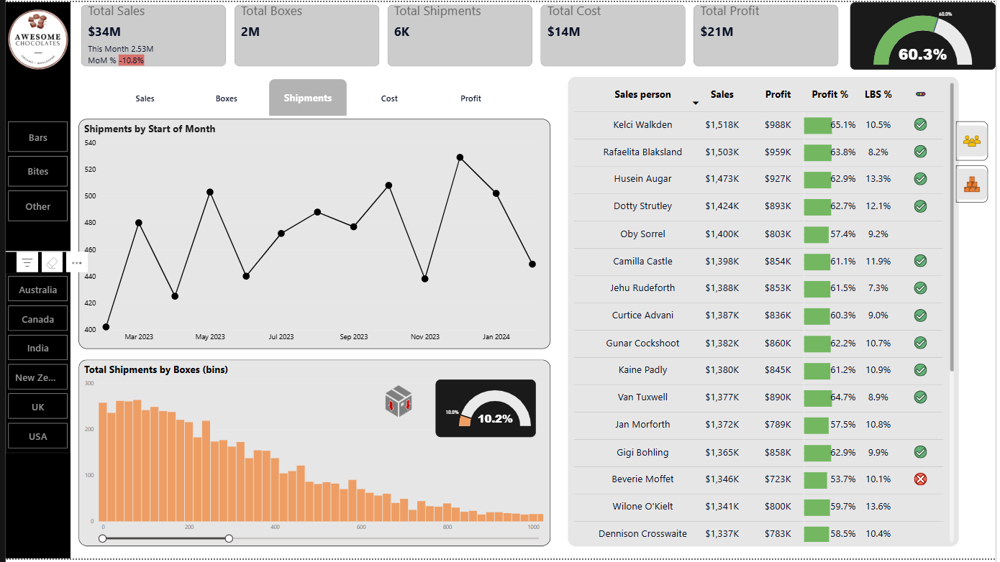

# Awesome Chocolates — Sales Analytics Dashboard (Power BI)

## Project Overview
An advanced end-to-end sales analytics dashboard built in Microsoft Power BI using the
Awesome Chocolates dataset. This project covers the full analytics workflow — from data
modelling and DAX measure development to interactive dashboard design with dynamic
visuals and custom filters.

---

## Objectives
- Build a clean star schema data model in Power BI
- Develop DAX measures for key business KPIs including Month-over-Month (MoM) changes
- Design an interactive, professional sales dashboard
- Analyse product performance, salesperson performance, and shipment trends

---

## Tools & Concepts Used
- **Microsoft Power BI** — data modelling, dashboard design, publishing
- **Power Query** — data loading and transformation
- **DAX** — KPI measures, time intelligence, MoM calculations, dedicated measures table
- **Star Schema** — fact and dimension table relationships
- **Field Parameters** — dynamic trend analysis chart
- **Bookmarks** — toggle between Product and Salesperson views
- **Tooltips** — country-level breakdown on hover

---

## Dataset
The Awesome Chocolates dataset includes:
- Sales transactions with product, salesperson, and country details
- Shipment records
- A Calendar/Date table for time intelligence

---

## Dashboard Features

### KPI Cards
- Total Sales, Total Profit, Profit %, LBS %
- Month-over-Month (MoM) change indicators with reference labels

### Visuals
- **Dynamic Trend Chart** — switchable between Sales, Profit, and other metrics using Field Parameters
- **Shipment Analysis** — histogram with zoom slider
- **Salesperson Performance Table** — with conditional formatting
- **Product Performance Table** — with conditional formatting
- **Profit % Gauge Chart** — visual target tracking
- **Tooltip Pages** — country breakdown on hover
- **Slicer Panel** — show/hide filter panel with bookmarks

---

## Key Concepts Demonstrated
- Star schema data modelling from scratch
- Time intelligence DAX (MoM, running totals) using a Calendar table
- Dynamic visuals with Field Parameters
- Advanced table formatting with conditional formatting
- Bookmark-based navigation and view toggling
- Custom tooltip pages for drill-through context

---

## Screenshot

---

## How to View
1. Download the `.pbix` file from this repository
2. Open with [Microsoft Power BI Desktop](https://powerbi.microsoft.com/desktop/) (free)
3. Use the slicer panel and bookmark toggles to explore the dashboard interactively

---

## Notes
This project was built as part of my data analytics portfolio following Chandoo's
advanced Power BI masterclass. The dashboard structure and analysis logic follow
the tutorial; minor adjustments were made during the build process.
